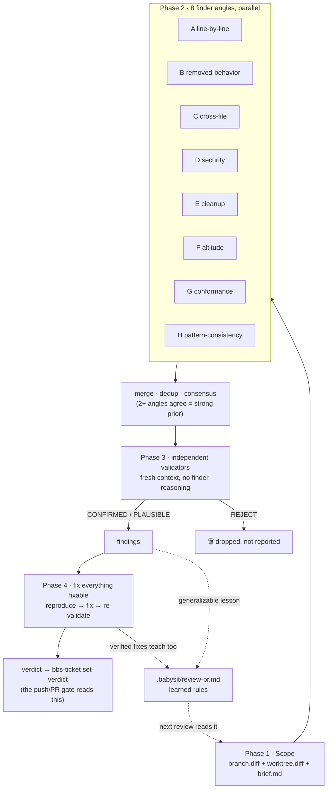

# review-pr: teaching one AI to stop grading its own homework

## The confession

Our old `review-pr` skill had a dirty secret: it was **one Claude, one context,
one pass**. It read the diff, squinted at it through four "lenses", then
verified its own suspicions... using the same brain that had them. That's not
code review — that's a student grading their own exam and acting surprised
about the A+.

The result: reviews that finished suspiciously fast and found suspiciously
little. "LGTM 🚀" energy. Meanwhile Claude Code's built-in `/code-review` and
Cursor's Bugbot were out there catching real bugs in real PRs. Time to steal
their homework instead. (Legally. With credits. See the end.)

## What the big kids do

Reading how [Claude Code's `/code-review`](https://code.claude.com/docs/en/code-review)
and [Cursor's Bugbot](https://cursor.com/blog/building-bugbot) work, one design
rule shows up everywhere:

> **The context that finds a bug must never be the context that confirms it.**

Bugbot v1 ran *eight parallel passes over the diff in randomized order*, then
used majority voting plus a validator model to kill false positives. Bugbot v2
went agentic: aggressive finders told to chase every suspicious pattern,
because a strict validator cleans up after them. Claude Code's review runs
parallel finder agents, then launches a **fresh verification agent per issue**
whose whole job is to try to destroy the finding.

Recall and precision are separate jobs, done by separate contexts. Genius.
Also, in hindsight, extremely obvious. (The best ideas always are.)

## The new pipeline

`review-pr` now runs **eight finder angles** in parallel, each a specialist
with tunnel vision — and tunnel vision is a *feature* here:

| Angle | Hunts for |
|-------|-----------|
| **A** line-by-line | "what input makes this exact line wrong?" — off-by-one, falsy-zero, swallowed errors |
| **B** removed-behavior | every deleted line enforced *something* — where did that invariant go? |
| **C** cross-file tracer | you changed the function; did anyone tell its callers? |
| **D** security & data | injection, missing authz, destructive ops without a seatbelt |
| **E** cleanup | reinvented helpers, dead code, N+1 queries |
| **F** altitude & conventions | bandaid fixes on shared infrastructure; quoted CLAUDE.md violations |
| **G** conformance | acceptance criteria with zero diff evidence; scope drift |
| **H** pattern-consistency | your new endpoint vs its siblings: "all your brothers take the lock, why don't you?" |

Every candidate needs a **nameable failure scenario** — concrete input/state →
wrong outcome. "This looks sketchy" is not a scenario; it's a vibe.

Then the trust-nobody phase: each CRITICAL/MAJOR candidate goes to an
**independent validator** that gets the claim but *not* the finder's
reasoning, traces the real code path, and returns `CONFIRMED`, `PLAUSIBLE`,
or `REJECT` — with a built-in false-positive list (pre-existing issues,
linter-catchable stuff, pedantic nitpicks a senior engineer would roll their
eyes at).

## No babysitter, so it fixes things

Babysit's whole premise is running with nobody at the keyboard — and a
finding that just sits in a report is a finding waiting for a human who
isn't there. So the skill doesn't stop at pointing: **it fixes everything
fixable, then proves it**. Mechanical stuff (dead code, convention drift)
gets fixed and re-checked against the type-checker and tests. CONFIRMED
CRITICAL/MAJOR bugs get the full treatment: write a test that reproduces the
validator's failure scenario, apply the smallest fix, run the suite — then
hand the fix to a **fresh validator**, because the same house rule applies
everywhere: the context that wrote the fix doesn't get to approve it.

The only things left as findings are the genuinely human calls — the bug is
real but the *intended* behavior is ambiguous, or the fix would pick product
semantics nobody wrote down. Those block the PR and wait. Everything else?
Already fixed by the time you read the report.

## The Bugbot party trick: it learns

The thing Cursor genuinely nailed: Bugbot [self-improves with learned
rules](https://cursor.com/blog/bugbot-learning) from your team's PR history.
So `review-pr` got the same loop: when a CONFIRMED finding — or a Phase-4
fix that verified — teaches a lesson that generalizes ("every `bbs-ticket`
subcommand takes the lock before mutating state"), it's appended to
`<repo>/.babysit/review-pr.md`. Fixes count on purpose: the drift the skill
quietly fixes *every single review* is exactly the lesson worth writing
down, and without it the reviewer would keep mopping the same floor forever.
Every future review pastes that file into the finders' brief, and angle H
enforces it like law — skipping rules already there, so the file doesn't
grow a duplicate per review. Your reviewer gets smarter every time it
catches you. Slightly terrifying. Very useful.

## Did it work?

First dogfood run on a 9,200-line-deletion PR: the old skill would have
skimmed it in one context and called it a day. The new one dispatched five
finder agents that independently went spelunking through `bbs-ticket`'s guts.
The review is no longer fast. That's the point — **fast was the bug**.

---

## Credits

This skill shamelessly learns from the giants:

- **Claude Code's `/code-review` command** — the parallel finders + per-issue
  verification agents + false-positive exclusion list.
  [code.claude.com/docs/en/code-review](https://code.claude.com/docs/en/code-review)
- **Cursor's Bugbot engineering blogs** — randomized parallel passes, majority
  voting, aggressive-finder-plus-strict-validator, and self-improving learned
  rules. [Building a better Bugbot](https://cursor.com/blog/building-bugbot) ·
  [Bugbot now self-improves with learned rules](https://cursor.com/blog/bugbot-learning)
