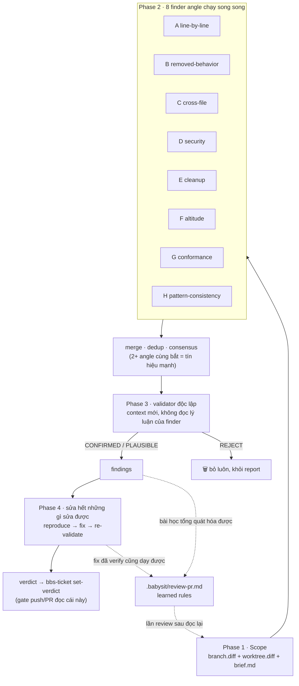

# review-pr: dạy con AI bỏ thói tự chấm bài của mình

## Thú tội

Skill `review-pr` cũ của tụi mình có một bí mật khó nói: nó là **một Claude,
một context, một pass**. Nó đọc diff, nheo mắt soi qua bốn cái "lens", rồi tự
verify mấy nghi ngờ của mình... bằng đúng cái não vừa đẻ ra tụi nó. Đấy không
phải code review — đấy là học sinh tự chấm bài thi của mình, xong còn giả vờ
ngạc nhiên khi được điểm 10.

Kết quả: review xong nhanh đến mức đáng ngờ, tìm ra ít bug đến mức đáng ngờ
hơn. Đúng kiểu "LGTM 🚀" cho xong chuyện. Trong khi đó, `/code-review` có sẵn
của Claude Code với Bugbot của Cursor đang bắt bug thật trong PR thật ngoài kia.
Thôi, đi chép bài con nhà người ta vậy. (Chép hợp pháp nha, có ghi credit
đàng hoàng. Xem cuối bài.)

## Con nhà người ta làm thế nào

Ngồi đọc cách [`/code-review` của Claude Code](https://code.claude.com/docs/en/code-review)
và [Bugbot của Cursor](https://cursor.com/blog/building-bugbot) vận hành,
thấy một nguyên tắc thiết kế cứ lặp đi lặp lại khắp nơi:

> **Context tìm ra bug không bao giờ được quyền xác nhận chính bug đó.**

Bugbot v1 chạy *tám pass song song trên cùng một diff, mỗi pass xáo thứ tự
một kiểu*, rồi lấy majority voting cộng một validator model để diệt false
positive. Bugbot v2 chuyển hẳn sang agentic: đám finder được lệnh cứ hung
hăng đuổi theo mọi pattern khả nghi, vì phía sau đã có validator khó tính
dọn dẹp. Review của Claude Code thì chạy các finder agent song song, xong mở
**một verification agent mới tinh cho từng issue** — nhiệm vụ duy nhất của
nó là cố bóp chết cái finding đó.

Recall và precision là hai việc khác nhau, giao cho hai context khác nhau.
Thiên tài. Mà ngẫm lại thì... hiển nhiên đến phát bực. (Ý tưởng xịn nào
chẳng thế.)

## Pipeline mới

`review-pr` giờ chạy **tám finder angle** song song, mỗi con là một chuyên
gia bị tunnel vision — và ở đây tunnel vision là *feature*:

| Angle | Săn gì |
|-------|--------|
| **A** line-by-line | "input nào làm đúng dòng này sai?" — off-by-one, falsy-zero, error bị nuốt |
| **B** removed-behavior | mỗi dòng bị xóa từng gác một *cái gì đó* — invariant ấy giờ trôi dạt phương nào? |
| **C** cross-file tracer | sửa function rồi đấy, thế đã báo cho đám caller chưa? |
| **D** security & data | injection, thiếu authz, thao tác phá hoại chạy không thắt dây an toàn |
| **E** cleanup | helper bị phát minh lại, dead code, N+1 query |
| **F** altitude & conventions | fix kiểu dán băng keo lên hạ tầng chung; vi phạm CLAUDE.md bị quote rule tận mặt |
| **G** conformance | acceptance criteria không để lại dấu vết gì trong diff; scope drift |
| **H** pattern-consistency | endpoint mới vs các anh em của nó: "cả nhà đều take lock, sao mỗi chú không?" |

Mỗi candidate phải kèm một **failure scenario gọi tên được** — input/state cụ
thể → kết quả sai cụ thể. "Nhìn hơi lấn cấn" không phải scenario; đấy là vibe.

Rồi tới màn không-tin-một-ai: từng candidate CRITICAL/MAJOR bị đẩy sang một
**validator độc lập** — nhận claim nhưng *không* được đọc lý luận của finder,
tự trace code path thật, rồi phán `CONFIRMED`, `PLAUSIBLE`, hoặc `REJECT` —
kèm sẵn danh sách false-positive (issue có từ đời nào rồi, thứ linter tự bắt
được, mấy cái nitpick mà senior engineer nghe xong chỉ muốn đảo mắt).

## Không có babysitter, nên nó tự sửa

Toàn bộ ý tưởng của babysit là chạy khi không có ai ngồi ở bàn phím — mà một
finding nằm chỏng chơ trong report là một finding đang chờ một con người
không tồn tại. Nên skill này không dừng ở việc chỉ trỏ: **sửa hết những gì
sửa được, rồi chứng minh**. Lỗi mechanical (dead code, convention drift) sửa
thẳng, xong chạy lại type-checker với tests. Bug CRITICAL/MAJOR đã CONFIRMED
thì được trọn gói: viết một test tái hiện đúng failure scenario của
validator, áp cái fix nhỏ nhất có thể, chạy suite — rồi đưa cái fix cho một
**validator mới tinh** soi, vì luật nhà này áp dụng ở mọi nơi: context viết
ra cái fix không được quyền tự duyệt nó.

Chỉ còn đúng một loại được nằm lại làm finding: mấy quyết định thật sự phải
hỏi con người — bug có thật nhưng behavior *đúng ý* thì mù mờ, hoặc cái fix
sẽ phải tự chọn product semantics mà chưa ai viết ra. Đám đó chặn PR và ngồi
chờ. Còn lại? Lúc bạn mở report ra đọc thì sửa xong hết từ đời nào rồi.

## Chiêu tủ của Bugbot: nó biết học

Món Cursor làm hay thật sự: Bugbot [tự khôn lên bằng learned
rules](https://cursor.com/blog/bugbot-learning) rút từ lịch sử PR của team.
Nên `review-pr` cũng chơi đúng loop đó: khi một finding CONFIRMED — hoặc một
fix ở Phase 4 đã verify xong — để lại bài học dùng lại được ("mọi subcommand
của `bbs-ticket` phải take lock trước khi mutate state"), nó được append vào
`<repo>/.babysit/review-pr.md`. Tính cả fix là cố ý đấy: cái drift mà skill
lẳng lặng sửa *ở mọi lần review* chính là bài học đáng ghi nhất, không ghi
thì reviewer cứ lau đúng một vũng nước đến hết đời. Lần review sau, file này
được dán thẳng vào brief của đám finder, và angle H thực thi nó như luật —
rule nào có sẵn trong file thì bỏ qua, khỏi mỗi review đẻ thêm một dòng
trùng. Reviewer của bạn khôn lên sau mỗi lần bắt quả tang bạn. Nghe hơi rợn.
Nhưng mà tiện thật.

## Thế có ăn thua không?

Lần dogfood đầu tiên, trên một PR xóa 9.200 dòng: skill cũ chắc lướt một
context là xong, phủi tay đi về. Skill mới thả năm finder agent, mỗi con tự
chui xuống hầm mò từng ngóc ngách của `bbs-ticket`. Review giờ không còn
nhanh nữa. Mà đấy chính là mục đích — **nhanh mới là bug**.

---

## Credits

Skill này học lỏm không giấu giếm từ các đàn anh:

- **Lệnh `/code-review` của Claude Code** — đội finder song song + verification
  agent riêng cho từng issue + danh sách loại trừ false-positive.
  [code.claude.com/docs/en/code-review](https://code.claude.com/docs/en/code-review)
- **Loạt blog kỹ thuật về Bugbot của Cursor** — các pass song song xáo thứ tự,
  majority voting, finder hung hăng + validator khó tính, và learned rules tự
  khôn lên. [Building a better Bugbot](https://cursor.com/blog/building-bugbot) ·
  [Bugbot now self-improves with learned rules](https://cursor.com/blog/bugbot-learning)
