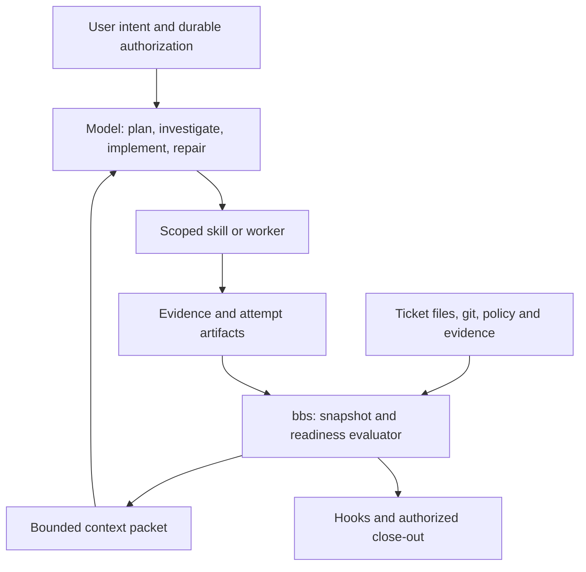

# Architecture

## Observed baseline

These are source observations and resulting design implications, not measured runtime costs.

| Evidence | Observation | Implication |
|---|---|---|
| [autopilot.go](../../internal/cmd/autopilot.go), `probeState` | Invokes ticket commands repeatedly; initializes ticket state while probing; remote branch existence represents `branchPushed` | Provide one explicitly read-only snapshot; distinguish remote existence from an up-to-date push |
| Same file, `recover` and `checkpoint` | Recovery prints checkpoint plus recent global timeline; checkpoints track HEAD and same-step counters | Retain durable recovery, filter by ticket/run, and distinguish waiting from repeated failure |
| [gitflow.go](../../internal/cmd/gitflow.go), `gitFlowFrom` | Unconfigured profile is `pet`; finish defaults to `review`; explicit keys and legacy aliases exist | Keep this resolver authoritative and expose provenance |
| [builder.md](../../.claude/skills/autopilot/workflows/builder.md) | Missing configuration is seeded as `startup` | Reconcile this behavioral disagreement explicitly; stop silently rewriting a default policy during execution |
| [preamble.md](../../.claude/skills/references/preamble.md) | Contains repeated shell bootstrap, recovery, upgrade checks, and a branch-anchor invariant | Replace mechanical bootstrap with a small CLI entry; use the canonical identity ladder |
| [identity.md](../identity.md), [identity.go](../../internal/identity/identity.go) | Environment, manifest, and legacy branch identity coexist | Do not make a second ticket resolver or require a feature branch |
| [ticket_verdict.go](../../internal/cmd/ticket_verdict.go) | Status is parsed from mutable Markdown; recognized status is validated on write | Status remains useful for display; current readiness needs typed provenance |
| [ticket_handoff.go](../../internal/cmd/ticket_handoff.go) | Typed verification evidence exists; QA evidence checks rubric/prose patterns | Extend these paths; schema validity and claimed freshness are distinct from checked code identity |
| [pre-tool-gate](../../bin/hooks/pre-tool-gate) | Hooks compose status/evidence reads and ask/deny policy | Share semantic readiness with land/PR and preserve harness-specific response transport |
| [autopilot SKILL.md](../../.claude/skills/autopilot/SKILL.md), current edits | Independent sequential gate workers, capability-aware routing, parent git ownership | Formalize attempts and assignments without requiring terminal transport for native workers |
| [autopilot_spawn.go](../../internal/cmd/autopilot_spawn.go), [agent.go](../../internal/agent/agent.go) | Existing process spawning and harness profiles | Extend adapters; do not invent model IDs or duplicate spawning machinery |
| [integration plan](../../tests/autopilot-integration-plan.md) | Contains older strict/dirty-tree expectations alongside migration notes | Audit fixtures against accepted contracts before using aggregate pass counts as evidence |

History reinforces the priorities. `6a54185` made current-branch work the default; `c1c6df3` selected `pet` for unconfigured repositories. `6311a41` repaired verifier routing, trust preflight, and unsupported “pre-existing failure” claims. `dfa7fc7` rejected verdict bodies that every consumer would read as missing; `6ccb85e` corrected dead-verifier evidence paths. These are concrete reasons to put mechanical contracts and failure provenance in code.

## Ownership

| Layer | Owns | Does not own |
|---|---|---|
| Model / autopilot skill | Intent interpretation, architectural judgment, work loop, targeted investigation, repair, git orchestration | Reimplementation of identity/policy/readiness rules |
| CLI shared functions | State reads, typed contracts, gate evaluation, atomic writes, exact freshness checks | Product decisions or a script for every implementation action |
| Workflow Markdown | Archetype/mode intent, declarative prerequisites, terminal obligations, stop points | Repeated shell plumbing or per-skill git protocols |
| Domain skills | Their specialist analysis, bounded edits, evidence and handoff | Branch creation, push, close-out |
| Harness adapter | Available tools, invocation syntax, worker execution/wait/cancel, usage observations | Business policy or claimed capabilities absent from the session |
| Foreman | Independent-ticket scheduling, existing design checkpoint policy, resource coordination | Overriding worker failures or fabricating gate success |
| Hooks / land / PR | Recheck readiness and existing authorization at the mutation boundary | Treating cached advice as permission |
| Dashboard / analytics | Explain current state and observed outcomes | A second writer of derived gate truth |

Use `internal/identity`, `internal/ticket`, and `internal/agent` as established boundaries. Initially keep orchestration helpers near `internal/cmd/autopilot.go`; extract an `internal/autopilot` package only when hooks/dashboard/CLI need the same non-command functions. Avoid self-spawning the binary from shared state collection. Reuse the repository's locking/atomic-write pattern after checking its platform guarantees.

## Execution

1. **Entry:** resolve the existing ticket or take conversation context. Autopilot may initialize a ticket; directly invoked skills may work without one. Resolve harness capabilities from the session; do not infer the active harness from installed binaries.
2. **Observe:** read one coherent snapshot of identity, policy, control state, workflow/mode inputs, artifacts, git, active attempt, and evidence. No fetch, init, session pruning, upgrade, or checkout during this read.
3. **Choose:** present unmet obligations and permitted next action classes. The model chooses its investigation and implementation steps. A named archetype is valid direction; missing workflow-specific prerequisites are checked only where needed.
4. **Work:** load the selected skill and required references fully once per unchanged version in that session, perform the work, and save non-derivable findings at milestones.
5. **Verify:** review, integrate fixes, then QA. Prefer a suitable independent worker when available and allowed; explicit process verification retains its stronger isolation requirement. Serialize mutating gate workers. Any QA code fix invalidates prior review until the final change is reviewed again.
6. **Reconcile:** reread evidence and code identity; rerun invalidated gates. Checkpoint observed outcomes. A repeated wait is not a failed iteration.
7. **Finish:** check current control/authorization and fresh evidence at the boundary, execute only the configured action, record its actual outcome, and hand off.

`--stop-after=requirement|plan`, explicit user restrictions, dashboard decisions, and foreman hold policy remain effective. Do not broaden authority in the name of reducing interruptions. Resolve minor design choices using the existing Auto-Decision Framework and log them; ask only for information or authority the run actually lacks.

## Context strategy

Keep full artifacts as the source of truth. A context packet is a disposable view, never an authority or a substitute for required skill reading.

The first packet includes: objective and acceptance-criteria references, constraints and unresolved decisions, effective policy, current code identity, mode and unmet gates, active attempt, and a small artifact index. Every artifact entry has a path, digest, role, and whether full reading is mandatory before the current action. The CLI copies structured fields or verbatim excerpts; it does not invent a semantic summary.

Warm reads compare an opaque snapshot cursor and return changed fields plus invalidations. A session also tracks which skill/reference digests it has read; capability or instruction changes invalidate that cache. A cold session uses the durable snapshot, required artifact files, and latest decision/handoff artifacts. It must not recover from a short summary alone.

Suggested initial output targets: state JSON under 8 KiB for ordinary single-repo tickets; context view around 1,500–2,500 estimated tokens; unchanged delta under 512 bytes. These are evaluation targets. Critical constraints and blockers cannot be silently truncated to meet them. Overflow returns an explicit list of omitted artifact paths and `requires_read`, with an opt-in full view. Actual provider token usage may differ from local estimates.

Tool results return status, exit code, relevant error excerpt, and full log path. Full logs remain available and are read when diagnosis needs them. No raw secrets, environment dumps, or credentials enter context packets or telemetry. Do not add an embedding service: begin with artifact indexes, exact digests, targeted `rg`, and the existing ticket similarity facilities.

## Verification and runtime surfaces

Code identity uses the complete tracked tree plus staged/unstaged changes and relevant untracked inputs, not HEAD alone. Final release readiness requires a clean intended change and a recorded base commit. Generated/ignored inputs that affect QA are represented by the surface/test fingerprint; unknown inputs prohibit evidence reuse.

Parent workers own commits, QA surface preparation and leases. Native gate workers edit only their assigned scope. Existing process verifiers may commit their own fixes under their documented contract, but cannot push or close out; the parent reconciles their final revision. Worktree QA continues to reuse current merge-base/switch/lease behavior. A shared surface must prove which revision and dependencies it serves, independently of where the shell is running.

A gate result records the final code it inspected, not merely the dispatch revision. Dependency locks, test commands, relevant QA configuration, build revision, and environment identity contribute to freshness. Dynamic external state is explicitly non-reusable across attempts unless an immutable fixture identifies it. Unknown runtime access produces a named limitation or fallback, never a fabricated pass.

## Scope across the pack

Builder adopts the contracts first. Prototyper, Sweeper, Grower, and Maintainer keep their mandates and terminal outputs; only code-shipping paths require the same review/QA readiness rules. Research, copy, and social artifacts do not acquire irrelevant branch gates. Every directly invoked skill retains conversation-input fallback and no-ticket operation.

Planning, implementation, review, QA, investigation, and handoffs share an artifact index and decision records. The preamble becomes a small runtime entry plus shared behavioral guidance. Skill-specific analysis remains in each skill, with optional references loaded by explicit relevance. Workflow authoring/linting checks declarative gates and required outputs. Installation/plugin packaging must ship the new references and negotiate CLI contract support. No dashboard redesign is required: update existing status/detail readers to display stale evidence, blocked reasons, and usage availability.
