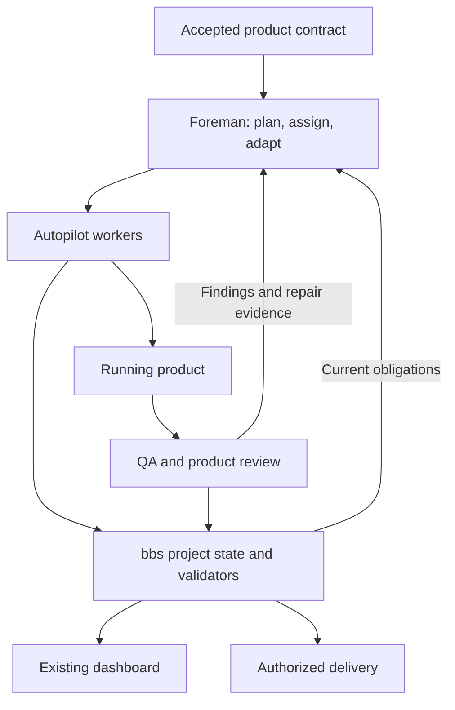

# Making Foreman a stronger autonomous product lead

Investigation: 2026-09-24. Source revision: `14690ecb43aacd6ae9429308e44e1192dc76ccf6`.

**Recommendation:** keep Foreman as the owner of product judgment, scope, worker assignments, and recovery decisions. Move mechanical project validation into the existing Go CLI. Connect those two layers through an explicit product contract and verifiable results, then expose the same facts in the dashboard.

The intended improvement is a higher rate of complete, usable products with fewer human interventions and less repeated work. Additional workers, a larger prompt, or a stronger default model are experiments to evaluate against that outcome.

This is an investigation and proposed direction. Production code and skills were not changed. Findings distinguish observed behavior from proposed improvements; no live agent benchmark establishes the size of any expected gain.

## What already works well

The existing design is substantial. Preserve these contracts:

- Foreman owns topology; each autopilot worker owns one checkout and local commits.
- Parent product design precedes child creation, with an explicit `--auto` path and revision-bound approval.
- Dependencies, shared interfaces, acceptance ownership, repair dispatches, and changes to accepted scope already have rules.
- Orca supplies supervised Tasks/Dispatches, durable delivery, and recovery identity. The global resource broker already handles admission and cross-owner reconciliation.
- Review and QA must converge on the final code. Parent integration QA is mandatory for every code-bearing project, including independent children.
- Local delivery, remote delivery, and cleanup are separate facts. A finished terminal is not proof of a delivered product.

Sources: [Foreman](../.claude/skills/foreman/SKILL.md), [project contract](../.claude/skills/foreman/references/project-contract.md), [autopilot](../.claude/skills/autopilot/SKILL.md), [resource reconciliation](../internal/cmd/foreman_resource.go).

## Findings that drive the proposal

| Finding | Observed evidence | Consequence |
|---|---|---|
| Project completion depends on the model obeying prose. | `foremanHeartbeat` directly stores an arbitrary status in [foreman.go](../internal/cmd/foreman.go), line 441. `watchTick` closes a `done` coordinator after its grace period in [foreman_watch.go](../internal/cmd/foreman_watch.go), line 338. The actual project completion conditions are in the skill/project contract. | A premature `done` can close the coordinator without the CLI establishing acceptance coverage, final integration QA, delivery, or cleanup. The instruction is strong; this mutation boundary does not enforce it. |
| Strong ticket evidence exists but is optional. | [Operator documentation](autopilot-v2-operators.md), line 50, makes v2 checkpoints opt-in. The legacy branch of `evaluateReadiness` in [autopilot_readiness.go](../internal/cmd/autopilot_readiness.go), line 58, accepts `DONE`/`DONE_WITH_CONCERNS` statuses. Its [legacy regression test](../internal/cmd/autopilot_readiness_test.go), line 181, explicitly preserves that behavior. | Foreman's own inspection remains essential on legacy runs. Do not present every `ready:true` result as providing the same assurance. Other release checks still exist; this is specifically a gap in the shared readiness result. |
| Evidence validity and acceptance coverage are different checks. | V2 validates provenance, current digests, lifecycle, exit codes, and referenced log digests. Its validator does not check `acceptance_ids` against required criteria; `log_path` is optional. `currentSurfaceFingerprint` hashes a fixed list of root dependency/config files. See [autopilot_readiness.go](../internal/cmd/autopilot_readiness.go), lines 174 and 355. | Valid evidence can still leave required behavior uncovered. The fingerprint alone cannot establish which running server/build was tested. Runtime identity and semantic coverage remain skill responsibilities. |
| Liveness and useful progress are weakly distinguished. | The configured full reconciliation interval defaults to 3,600 seconds in [config.go](../internal/config/config.go), line 173; record liveness expires after ten minutes in [foreman.go](../internal/foreman/foreman.go), line 31. The watcher hashes terminal output and explicitly treats a changing spinner as activity. | A permitted quiet wait can outlast heartbeat validity unless something refreshes it. Animated output can look active without new evidence. This is a source-level mismatch, not a measured frequency of stalled production runs. |
| Product quality has good written checks but limited independent critique. | [QA](../.claude/skills/qa/SKILL.md) already requires journeys, failure cases, adjacent regressions, and a final-state pass. [Autopilot](../.claude/skills/autopilot/SKILL.md), line 251, runs ticket QA in the builder's session. Review at medium and higher effort already uses independent finder/verifier agents; final project QA already uses a separate worker. | Strengthen the existing independent project gate around product usefulness, coherence, and interaction depth. Duplicating every ticket gate in more agents would add cost without demonstrated benefit. |
| Some generic skill rules conflict with delegated design autonomy. | [design-ui](../.claude/skills/design-ui/SKILL.md), line 25, categorically treats new-project brand/style as a User Challenge and later requires human approval for new components. Foreman's `--auto` delegates routine design review. | A project that could make a reversible design choice may unnecessarily ask for a human. Distinguish missing business intent from choices delegated to Foreman. Preserve actual brand constraints and the non-delegable floor. |
| The dashboard is primarily a ticket/session view. | [Foremen.tsx](../web/src/views/Foremen.tsx), line 206, routes a foreman row to its ticket list. The UI already has DAGs, prototypes, approvals, evidence, and ticket readiness; [TicketDetail](../web/src/lib/data.ts), line 236, has no typed project report/integration receipt field. | Extend the existing application with a project view that explains product coverage, integration, delivery, and blockers. A separate dashboard would duplicate existing capabilities. |
| Current measurements cannot establish which strategy produces better products. | [Foreman skill tests](../tests/test_foreman_skill.sh) largely assert instruction strings, alongside substantial Go behavior tests. The [v2 evaluation report](autopilot-v2-evaluation.md) records deterministic results and unavailable paired live usage. Local telemetry also has inconsistent terminal events and no observed provider usage for the examined core skills. | Measure final product outcomes and recovery, then compare orchestration strategies. Passing protocol tests alone cannot establish product quality. |

The main architectural diagnosis is that project-wide promises have advanced faster than the executable project contract. This does not prove existing runs routinely fail; it identifies where a model omission can bypass an intended guarantee.

The proposed ownership and feedback loop:



## 1. Give Foreman an explicit product contract

Keep the existing parent `requirement.md`, `design.md`, prototype, and thin `plan.md`. Extend the parent manifest with a small structured acceptance section, or a referenced structured companion when parsing Markdown would be fragile. It should carry only information the scheduler and evaluator need:

- Target user, primary job, and the observable successful outcome.
- Required journeys with stable criterion IDs and explicit non-goals.
- Relevant quality requirements: interaction completeness, design consistency, accessibility, realistic data behavior, performance, and operational checks where applicable.
- Owner child/milestone, dependencies, verification method, and evidence references for each criterion.
- Product assumptions with supporting evidence, uncertainty, and the condition that would require replanning.

For example, “export works” becomes `EXPORT-1`: create an item, export it, reopen the exported artifact, and confirm its content. An enabled button and a green unit test do not satisfy that journey.

Preserve human-readable reasoning. Machine validation can establish that every required ID has fresh evidence and no unresolved blocker. A qualified evaluator must still judge whether that evidence actually proves the behavior.

The accepted criteria belong to the parent contract. A builder may propose a clarification, but cannot delete a difficult criterion or lower a threshold to obtain a pass. Scope changes use the existing change-request and parent approval revision mechanism.

### Plan around a working product journey

Start an unfamiliar product with the smallest complete vertical journey: real UI or client, real API, persisted state, and a usable result. Use `prototype` first only when a concrete technical assumption needs a spike. Once the shared contracts are demonstrated, expand independent slices in parallel.

This supplements the existing decomposition rules. Foreman should prioritize uncertainty reduction, dependency unlocks, and reviewable outcomes. Four ready workers are useful only when their work can converge without excessive shared-file conflict or a growing QA queue.

Keep the five archetypes. Extend parent planning to describe the user outcome. Use `office-hours` in its supported developer mode when real product direction is missing; an unattended run routes that missing intent through the existing escalation channel. Do not turn all project planning into a permanent committee or force small tickets through product discovery.

## 2. Put project validation in the CLI

Add a small project layer over existing ticket state, the v2 evaluator, and Orca observations. Suggested command names below are proposals, not commands implemented today:

| Proposed command | Responsibility |
|---|---|
| `bbs foreman snapshot <parent> --json` | Pure observation of accepted scope, approval revision, child/dependency revisions, live Dispatch state, evidence, resources, delivery, and unresolved obligations. Every external observation carries freshness or `unknown`. |
| `bbs foreman readiness <parent> --action dispatch\|finish --json` | Shared validator for the intended action. Returns explicit reasons such as missing criterion evidence, changed dependency head, stale integration result, or unresolved cleanup. |
| `bbs foreman complete <parent>` | Rechecks current project readiness and ownership, persists a completion receipt, then updates terminal state. The watcher consumes that validated receipt. |

Route the existing terminal `done` path through the same validation, so the old command cannot remain an accidental bypass. Keep partial delivery, blocked, paused, and in-review outcomes explicit.

A project completion receipt should bind the parent approval/criteria revision, required child set, verified child and dependency revisions, integration evidence, finish policy, observed delivery, and cleanup result. Missing worktrees must still be recoverable from valid finish receipts, as the existing skill already requires.

Use existing ticket locks/revisions and Orca request recovery. A stale observation cannot authorize a later mutation: recheck local inputs at that boundary and reconcile changed external state. An append-only action/receipt trail is sufficient initially; a new distributed workflow engine is unnecessary for the demonstrated problem.

Keep Orca authoritative for Task/Dispatch lifecycle and Babysit authoritative for product acceptance and release policy. The project layer records cross-references rather than introducing another independently mutable task graph.

### Extend the existing evidence system

After producer support and compatibility checks are complete, use v2 by default for newly created Foreman code tickets. Preserve deliberate migration for historical tickets; do not reinterpret old Markdown as fresh typed evidence.

Add acceptance coverage validation and typed integration evidence. Capture command results through the CLI/harness where possible, including logs, exit status, and the observed revision. Record browser assertions/screenshots and runtime build identity through an equivalent producer path. Human/model observations remain visibly distinct from captured command results.

Reuse the existing immutable evidence and attempt records. Avoid making agents hand-author every digest and lifecycle field. This reduces accidental bookkeeping errors while retaining specialist judgment about what to test.

## 3. Add one focused product-review capability

Pilot `product-review` as a Foreman reference/assignment first. Promote it to a directly invocable skill only when repeated use establishes a distinct contract. Its mandate fits the Builder archetype's product acceptance work.

It evaluates the working product against the accepted user journey and design:

| Dimension | Concrete question |
|---|---|
| Usefulness | Can the intended user obtain the promised result from a realistic starting state? |
| Interaction depth | Do controls perform their claimed actions, persist state, and recover from failures? |
| Coherence | Do navigation, terminology, components, and transitions agree across worker-owned features? |
| Craft | Does the shipped UI match the accepted design at relevant sizes, including keyboard and error states? |
| Completeness | Are required journeys implemented fully, with no placeholders masquerading as finished behavior? |

Use a fresh evaluator context at the first integrated journey and the final project gate. Give it accepted criteria, design references, the actual runtime, and source when needed; ask it to explore independently before reading the builder's self-assessment. Reuse QA's executed evidence and reserve additional exploration for gaps.

Every blocking finding names the criterion, reproduction, observed behavior, artifact, and repair owner. Required criteria pass individually; an average score cannot hide a broken primary journey. Subjective preferences need reference examples and periodic human calibration, with stronger demands for originality only where the product brief warrants them.

Foreman dispatches repairs and reassesses the changed product. Preserve the best verified candidate when further aesthetic iteration regresses usability. Continue the existing bounded repair policy; budget exhaustion leaves remaining gaps explicit rather than turning them into a pass.

The case for this is supported by Anthropic's reported experiments with separate builders/evaluators and calibrated design criteria. Their later experiments also reduced orchestration overhead as models improved. This supports a selective pilot; it does not establish a gain for Babysit. [Harness design for long-running application development](https://www.anthropic.com/engineering/harness-design-long-running-apps).

## 4. Supervise useful progress and adapt deliberately

Track three facts separately: **runtime reachable**, **agent alive**, and **product progress**. A structured wait reason explains inactivity without claiming progress.

Use Orca's observed runtime/Dispatch state for liveness. Keep the existing pane watcher as a recovery signal when richer observations are unavailable, and record that limitation. Refresh runtime observations independently of the expensive model reconciliation interval; set their cadence comfortably inside the liveness threshold.

Progress should reference something inspectable: a new tested behavior, accepted artifact, resolved finding, or completed milestone. More commits, log lines, or changed files are context, not sufficient proof of progress.

| Observed condition | Foreman response |
|---|---|
| Live worker waiting on an active test, dependency, approval, or lease | Preserve the wait; continue unrelated admitted work. |
| Live worker with no new evidence and no valid wait reason | Inspect its actual obstacle; send a bounded diagnostic assignment before considering replacement. |
| Proven terminated worker | Recover its existing checkpoint/worktree and retry through the recorded Dispatch lineage. |
| Repeated semantic failure | Change the hypothesis, improve the contract, split the work into internal phases, or launch a more capable worker when policy permits. |
| Shared interface conflict or accumulating QA backlog | Reduce new starts, establish ownership, and prioritize integration/verification. |
| Genuine missing intent or authority | Escalate one concrete decision with evidence and preserve unaffected work. |

Never reclaim a live writer's checkout or resource lease based only on elapsed time. Retain the existing failure counts across replacement Dispatches and resumes.

Current routing classifies once and allows reclassification on scope change. Broaden that rule to admit evidence-driven capability escalation after a failed attempt, including Build when implementation itself is the demonstrated problem. Keep model selection a launch decision and record the effective model. Compare against the current routing before promoting a new default.

Add a per-project work/time budget and observed cost when the harness supplies it. Start with deterministic thresholds and transparent reasons. A learned scheduler is premature while completion and usage observations are incomplete.

## 5. Simplify skills around the new boundary

The canonical Foreman skill currently has 905 lines plus a 176-line project contract. Its length includes necessary rules, but repeated procedural bookkeeping competes with product reasoning.

Once corresponding CLI behavior exists, shrink the entry skill to ownership, decision loop, escalation, and terminal obligations. Load design, recovery, integration, and finish details only when relevant. Keep shared rules in one canonical reference and test executable contracts rather than preserving exact sentences.

Autopilot should retain one ticket, one writer, in-session planning/build/repair, and local commits. Add:

- A bounded assignment packet with parent intent, accepted criteria, design references, dependency revisions, write scope, capabilities, and constraints.
- Structured progress and blocker reports linked to its attempt.
- CLI-produced evidence receipts and explicit coverage gaps.
- A handoff that a fresh worker can use without replaying the entire implementation conversation.

Keep review's existing independent finder/verifier agents. Put the additional product evaluator at Foreman's integrated milestone boundary so autopilot does not regain nested orchestration responsibilities.

Resolve the `design-ui` autonomy inconsistency explicitly: authorized routine style/component choices follow the existing Taste framework and project checkpoint. Missing product audience, conflicting brand constraints, or a material direction change remains a User Challenge. A generic component novelty rule should not override a durable design delegation.

Audit unnecessary escalations with concrete fixtures too. The safety-floor scanner in [approval_selfresolve.go](../internal/cmd/approval_selfresolve.go) matches words across design artifacts, including `checkout`, `delete`, and `migration`. That establishes possible false positives such as a Git checkout instruction; it does not measure their frequency. Preserve enforcement for actual money, auth, and irreversible-data changes while making classification sensitive to the action and its context. An agent's unsupported claim that a change is safe must not become an escape hatch.

## 6. Extend the dashboard into a project view

Build on the current React dashboard and its existing approvals, prototype viewer, ticket DAG, controls, and evidence links.

The default project view should answer:

1. What outcome are we building, and which journeys are proven?
2. What can I open and use now, and which revision does that preview show?
3. Which workers are progressing, waiting, or blocked, and what will Foreman do next?
4. Which required checks or product findings remain?
5. Is delivery awaiting review, locally landed, in open PRs, or verified remotely?

Show a coverage table, critical dependency path, current runtime/preview, product-review findings, resource/QA queue, and delivery receipts. Put raw terminal logs behind drill-down. Display observed usage and unavailable usage distinctly.

Reuse the shared project snapshot/readiness implementation. The UI should render current facts and persist user controls through existing authority checks. New scope creates a change request rather than silently changing an active worker's assignment. Keep human interaction focused on intent, material exceptions, and the configured finish boundary.

## 7. Measure quality before increasing complexity

Local audit window: 2026-08-25 through 2026-09-24; the newest observed row was 2026-09-23. Counts are from `~/.babysit/analytics/skill-usage.jsonl` and were analyzed locally.

- Foreman had 40 rows: 28 `start`, seven `complete`, and five `end`.
- Nineteen of the 28 starting session IDs had neither a matching `end` nor `complete` in that window. They are unmatched telemetry, **not 19 proven failed projects**; resumes, ongoing work, and instrumentation gaps can produce this result.
- None of those Foreman rows carried `ticket`, `run_id`, `attempt_id`, harness, model, or provider usage. All carried `session`; six carried duration.
- Across the examined Foreman, autopilot, plan, review, and QA rows, no provider usage record had `available: true`.

Normalize lifecycle events and correlate project, ticket, Orca Dispatch, gate attempt, and invocation IDs. Capture events at CLI/harness lifecycle boundaries rather than relying solely on the model remembering a final logging snippet. Respect `telemetry: off` and leave unobserved usage unknown.

Extend the existing evaluation machinery with a small project benchmark: an ordinary CRUD journey, a polished UI flow, dependent API/UI work, a mid-run scope change, crash recovery, and a seeded false-completion case. Include held-out behavior checks and judge the final running application. Expand fixtures/repetitions before making general quality or cost claims.

Track accepted project completion, material defect escapes, intervention count, recovery correctness, repeated work, time to first usable journey, and total observed cost per accepted project. Score UI quality against calibrated examples. Compare one change at a time with the same model/tool policy, count failures and blocked runs, and inspect traces for disagreements with the grader.

Anthropic's evaluation guidance distinguishes an agent's transcript from the resulting environment and recommends combining executable, model, and human judgment where appropriate. Apply that distinction here: a successful tool sequence or claimed PASS is not itself the finished product. [Demystifying evals for AI agents](https://www.anthropic.com/engineering/demystifying-evals-for-ai-agents).

Keep cross-project learning small and evidence-linked: recurring defect, applicable context, successful remedy, and its source run. Reuse `analytics-review` to propose rule changes; verify them on fixtures before adoption. Automatically rewriting policies from every failure log would amplify bad conclusions.

## Suggested implementation order

| Order | Bounded deliverable | Verification that matters |
|---|---|---|
| 1 | Guard project completion, persist a typed integration/completion receipt, and separate runtime health from progress. Begin normalized lifecycle capture. | Reject `done` with a missing child, stale approval, failed/stale integration, or incomplete delivery; allow a valid receipt after child cleanup. Quiet valid waits remain healthy; a spinner cannot establish product progress. |
| 2 | Add the parent acceptance contract and shared project snapshot/readiness; complete v2 producer integration for new managed tickets. | A missing criterion, changed dependency head, old runtime, or post-QA code change prevents completion. CLI and dashboard return the same reasons. Cold resume preserves required scope. |
| 3 | Pilot the first usable journey plus a fresh product evaluator, then evidence-driven repair/routing. | Seed a disconnected UI action, lost persisted state, and inconsistent cross-feature flow; verify detection and repaired behavior. Compare cost and accepted outcomes against the current workflow. |
| 4 | Add the project dashboard view and promote only measured improvements. | A user can inspect coverage, the actual preview, blockers, and delivery without opening terminals. Benchmark results include failed runs, uncertainty, and usage coverage. |

The smallest useful first change is the validated project completion path. The highest-value product experiment is the fresh evaluator on an integrated user journey. These can be delivered incrementally using existing Orca and Babysit infrastructure.

## Investigation verification and limits

Reviewed canonical skills, project contracts, recent relevant history, Go CLI/state/evidence code, dashboard readers, tests, prior evaluation reports, and aggregated local telemetry. Source facts above are high confidence; expected improvements require a project benchmark.

Ran the focused existing behavior tests:

```sh
go test ./internal/cmd ./internal/foreman \
  -run '^(TestProjectApproval|TestForemanReport|TestV2Evidence|TestV2Readiness|TestLegacyReadiness|TestWatchOptsDefaultsAndValidation|TestWatchStatusIntervalFromConfig|TestLiveFollowsHeartbeat|TestWatchClosesDoneForeman)' \
  -count=1
```

Both packages passed. These tests cover existing approval, evidence freshness, compatibility, and watcher behaviors; they do not validate the proposed redesign. No live Orca project, browser QA session, or paid provider benchmark was run. Historical v2 evaluation results were treated as historical evidence, not rerun or presented as current whole-suite results.
